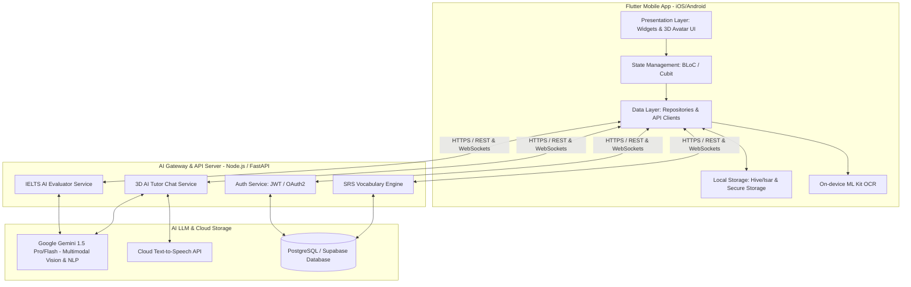

# 🛠️ Technical Implementation Plan: Language Learning & IELTS AI Assistant

## 1. Kiến trúc Hệ thống Tổng thể (System Architecture)
Hệ thống được thiết kế theo mô hình **Client-Server với AI Gateway Proxy**, đảm bảo bảo mật tuyệt đối API Key của các mô hình LLM và cung cấp hiệu năng mượt mà trên thiết bị di động.



## 2. Công nghệ & Thư viện Sử dụng (Tech Stack & Dependencies)

### 2.1. Frontend (Flutter Mobile App)
- **Framework:** Flutter 3.x (Dart 3.x).
- **State Management:** `flutter_bloc` (BLoC & Cubit) cho quản lý state phức tạp theo từng Feature Module.
- **3D Model Rendering:** `flutter_3d_controller` hoặc `model_viewer_plus` hỗ trợ tải và hiển thị file `.glb`/`.gltf` với khả năng điều khiển animation động (`idle`, `talking`, `happy`, `thinking`, `clapping`).
- **OCR & Image Processing:** `google_mlkit_text_recognition` cho nhận diện bước đầu, kết hợp gửi ảnh chất lượng cao lên Backend sử dụng Gemini Vision cho chữ viết tay phức tạp.
- **Audio & TTS:** `flutter_tts` cho phát âm offline, `just_audio` cho phát audio bài học chất lượng cao từ server.
- **Lưu trữ & Bảo mật:**
  - `flutter_secure_storage`: Lưu trữ JWT Token, User ID, Refresh Token.
  - `hive` / `isar`: Cơ sở dữ liệu cục bộ tốc độ cao cho danh sách từ vựng N5, thuật toán SRS SuperMemo-2 offline và bộ nhớ đệm bài kiểm tra.
- **UI/UX Utilities:** `lottie` cho micro-animations, `shimmer` cho loading state, `fl_chart` cho biểu đồ thống kê tiến độ học tập.

### 2.2. Backend (AI Gateway & Data API)
- **Runtime:** Node.js (NestJS / Express) hoặc Python (FastAPI).
- **AI/LLM Engine:** Google Gemini 1.5 Pro / Flash (ưu tiên vì khả năng xử lý Multimodal cực tốt cho cả ảnh chụp bài viết tay và nhận xét JSON có cấu trúc).
- **Database:** PostgreSQL (với Prisma ORM) lưu trữ thông tin người dùng, lịch sử nộp bài IELTS, điểm số chi tiết và nhật ký trò chuyện.
- **Real-time Chat:** WebSockets / Server-Sent Events (SSE) để stream câu trả lời từ AI Tutor, giúp avatar 3D phản hồi lập tức không cần chờ đợi toàn bộ câu trả lời.

## 3. Cấu trúc Quản lý State trong Flutter (State Management Design)
Ứng dụng áp dụng Clean Architecture chia thành các tầng:
- `lib/domain/`: Contains Entities, Value Objects, Use Cases, Repository Interfaces.
- `lib/data/`: Contains Repository Implementations, Data Sources (Remote API, Local DB), Models (JSON Serializable).
- `lib/presentation/`: Contains BLoC/Cubits, Screens, Widgets, 3D Avatar Viewers.

### Ví dụ về BLoC cho Tính năng IELTS AI Evaluation (`IeltsEvalBloc`):
- **Events:**
  - `IeltsEvalTopicSelected(Topic topic)`
  - `IeltsEvalImageCaptured(File imageFile)`
  - `IeltsEvalTextSubmitted(String essayText)`
  - `IeltsEvalRetryRequested()`
- **States:**
  - `IeltsEvalInitial`: Trạng thái ban đầu, chọn đề bài.
  - `IeltsEvalOcrProcessing`: Đang nhận diện chữ viết tay từ ảnh.
  - `IeltsEvalAnalyzing`: AI đang đọc và phân tích cấu trúc, từ vựng (hiển thị 3D Avatar đang suy nghĩ `thinking animation`).
  - `IeltsEvalSuccess(IeltsReport report)`: Hoàn tất chấm điểm (hiển thị 3D Avatar vỗ tay chúc mừng `happy animation`, hiển thị bảng điểm 4 tiêu chí).
  - `IeltsEvalFailure(String error)`: Lỗi kết nối hoặc không nhận diện được chữ.

## 4. Đặc tả API & JSON Schema (API Contracts)

### 4.1. API Chấm điểm IELTS Writing (`POST /api/v1/ielts/evaluate`)
**Request Header:** `Authorization: Bearer <JWT_TOKEN>`
**Request Body (Multipart Form or JSON):**
```json
{
  "prompt_id": "task1_bar_chart_01",
  "input_type": "text", // "text" | "image"
  "essay_text": "The provided bar chart illustrates the comparison between...",
  "target_band": 7.0
}
```
**Response JSON (Structured AI Output):**
```json
{
  "status": "success",
  "report": {
    "overall_band": 6.5,
    "sub_scores": {
      "task_achievement": 6.5,
      "cohesion_coherence": 6.5,
      "lexical_resource": 6.0,
      "grammatical_accuracy": 7.0
    },
    "general_comment": "Bài viết có bố cấu tốt, mô tả đầy đủ các xu hướng chính. Tuy nhiên vốn từ vựng miêu tả sự tăng giảm còn lặp lại nhiều.",
    "grammar_errors": [
      {
        "line_number": 3,
        "original": "The amount of cars increase dramatically in 2010.",
        "corrected": "The number of cars increased dramatically in 2010.",
        "explanation": "Dùng 'number' cho danh từ đếm được (cars) thay vì 'amount'. Thì quá khứ đơn cần chia động từ 'increased'."
      }
    ],
    "lexical_upgrades": [
      {
        "original_word": "go up very fast",
        "suggested_academic_words": ["experience a sharp surge", "soar significantly", "witness a steep rise"],
        "context_example": "The figures experienced a sharp surge from 20 to 80 million."
      }
    ]
  }
}
```

### 4.2. API Trò chuyện với 3D AI Tutor (`POST /api/v1/chat/ask`)
**Request Body:**
```json
{
  "message": "Trợ từ Ni và De trong tiếng Nhật khác nhau ở điểm nào khi chỉ địa điểm?",
  "module_context": "japanese_n5",
  "current_topic": "particles"
}
```
**Response JSON:**
```json
{
  "reply_text": "Chào bạn! Đây là câu hỏi rất hay. Trợ từ NI (に) dùng để chỉ địa điểm tồn tại (có cái gì ở đâu) hoặc điểm đến của hành động. Trong khi đó, DE (で) chỉ địa điểm diễn ra một hành động cụ thể nhé!",
  "avatar_emotion": "happy", // "idle" | "happy" | "explaining" | "thinking"
  "speech_audio_url": "https://api.app.com/tts/audio_123.mp3",
  "suggested_questions": [
    "Cho mình xin ví dụ câu với trợ từ De?",
    "Trợ từ E (へ) khác gì với Ni (に)?"
  ]
}
```

## 5. Phương án Tích hợp Mô hình 3D (3D Model Integration Strategy)
- **Định dạng file:** Sử dụng chuẩn **GLB (Binary glTF)** đã qua nén nhị phân (Draco compression) để kích thước file dưới 3MB, đảm bảo tải nhanh trên di động.
- **Bộ điều khiển Animation (Controller Bindings):**
  - Khi app mở: Phát animation `greeting_bow`.
  - Khi người dùng đang nhập liệu hoặc chọn đề: Phát animation `idle_breathing`.
  - Khi AI đang chấm bài / gọi API: Phát animation `thinking_scratching_head`.
  - Khi AI phát audio trả lời: Đồng bộ thời gian thực phát animation `talking_gesturing`.
  - Khi điểm IELTS >= 6.5 hoặc hoàn thành bài kiểm tra N5 10/10: Phát animation `cheering_clapping`.
