# 📚 Hệ Thống Tài Liệu & Nguyên Tắc Kiến Trúc (Project Documentation Hub)

Tài liệu trong thư mục `docs/` đóng vai trò là **Từ điển Nguyên tắc (Glossary & Principles Tree)**: xác định lý do tồn tại của các thành phần, cấu trúc phân lớp kiến trúc và các quy chuẩn mà lập trình viên hoặc AI Agents (`OpenCode`, `Antigravity`, `Hermes`, `MiMo`) không thể suy luận chỉ bằng cách grep mã nguồn thô.

> [!IMPORTANT]
> **Quy tắc Nguồn Sự thật Duy nhất (Single Source of Truth):**
> Mã nguồn tại `mobile/` và `backend/` là nguồn sự thật duy nhất cho *những gì đang tồn tại và hoạt động ngay lúc này*. Các tài liệu tại đây **không lặp lại chi tiết triển khai (không transcribe code/danh sách file cụ thể)** mà chỉ tập trung vào **nguyên tắc thiết kế (WHY)** và **điều hướng tới đúng thư mục/chủ sở hữu (WHERE & WHO)**.

---

## 🗺️ Cây Điều Hướng Tài Liệu (Downward Navigation Tree)

Mọi tài liệu trong dự án được tổ chức theo cấu trúc cây hướng xuống từ Hub này:

```mermaid
graph TD
    Hub["📚 docs/README.md (Hub Index)"]
    
    subgraph Arch [Kiến Trúc & Quy Trình SDD]
        SDD["sdd_project_plan.md<br>Kế hoạch & Phân quyền AI Agents"]
        Standards["architecture/ai_coding_standards.md<br>GitNexus & Clean Architecture"]
    end
    
    subgraph Features [Nguyên Tắc Đặc Tả Tính Năng]
        N5Plan["n5_advanced_features_plan.md<br>Nguyên tắc 3 chuyên đề N5"]
        AnimeVA["architecture/anime_va_voice_cloning_plan.md<br>VTuber & Voice Engine Pipeline"]
    end
    
    subgraph Guidelines [Quy Chuẩn Kỹ Thuật & UI/UX]
        UI["ui/ui_ux_and_3d_avatar_guidelines.md<br>Design Tokens & 3D Avatar"]
        Testing["testing/ai_verification_and_testing.md<br>3 Lớp Kiểm Thử & 60 FPS"]
        Security["security/data_privacy_and_security.md<br>Zero-Trust & Secure Storage"]
        Error["error/error_handling_and_logging.md<br>Distributed Tracing & Structured Log"]
    end

    Hub --> SDD & Standards
    Hub --> N5Plan & AnimeVA
    Hub --> UI & Testing & Security & Error
```

---

## 📑 Danh Mục Tài Liệu Theo Chủ Đề

### 1. Kiến Trúc & Quy Chuẩn Viết Mã (Architecture & Standards)
- **[Quy Chuẩn Lập Trình & GitNexus](file:///e:/GitHub/LanguageLearningApp/docs/architecture/ai_coding_standards.md):** Nguyên tắc bắt buộc đánh giá tác động trước sửa đổi (`gitnexus_impact`), cấu trúc Clean Architecture 3 tầng (`core/`, `domain/`, `data/`, `presentation/`) và quản lý state với BLoC.
- **[Kế Hoạch & Phân Quyền Đa Đại Lý SDD](file:///e:/GitHub/LanguageLearningApp/docs/sdd_project_plan.md):** Ma trận điều phối của đội ngũ AI (`Antigravity`, `OpenCode`, `Hermes`, `MiMo`) theo triết lý Spec-Driven Development.

### 2. Nguyên Tắc & Lý Do Thiết Kế Tính Năng (Feature Rationales)
- **[Đặc Tả 3 Tính Năng Nâng Cao Tiếng Nhật N5](file:///e:/GitHub/LanguageLearningApp/docs/n5_advanced_features_plan.md):** Lý do thiết kế và hợp đồng kiến trúc của Trạm Nghe Đàm thoại (`DialogueRoleplayScreen`), Trạm Luyện Ngữ pháp Kéo-Thả (`GrammarBuilderScreen`) và Đề thi thử JLPT N5 (`JlptMockExamScreen`).
- **[Hệ Sinh Thái VTuber & Clone Giọng Nói Anime VA](file:///e:/GitHub/LanguageLearningApp/docs/architecture/anime_va_voice_cloning_plan.md):** Kiến trúc luồng xử lý âm thanh Style-Bert-VITS2, Universal 3D Avatar Loader (`.glb`/`.vrm`) và đồng bộ khẩu hình Lip-sync thời gian thực.

### 3. Quy Chuẩn UI/UX, Kiểm Thử & Bảo Mật (Core Guidelines)
- **[Hệ Thống Design System & 3D Avatar](file:///e:/GitHub/LanguageLearningApp/docs/ui/ui_ux_and_3d_avatar_guidelines.md):** Bảng màu tự cảm hứng Duolingo (`Sakura Pink`, `Academic Navy`, `Feather Green`), chuẩn chữ Google Fonts (`Inter`, `Noto Sans JP`) và quy tắc phân bổ 3D Avatar Viewer trên các màn hình.
- **[Hướng Dẫn Kiểm Thử & Nghiệm Thu AI](file:///e:/GitHub/LanguageLearningApp/docs/testing/ai_verification_and_testing.md):** Tháp kiểm thử 3 lớp (Unit $\rightarrow$ Widget/BLoC $\rightarrow$ Integration Driver), tiêu chí duy trì 60 FPS và thời gian chấm bài AI dưới 10 giây.
- **[Bảo Mật Dữ Liệu & Quyền Riêng Tư](file:///e:/GitHub/LanguageLearningApp/docs/security/data_privacy_and_security.md):** Nguyên tắc Zero-Trust, cấm hardcode API Key dưới client, proxy qua AI Gateway và lưu trữ bảo mật bằng `flutter_secure_storage`.
- **[Xử Lý Lỗi & Structured Logging](file:///e:/GitHub/LanguageLearningApp/docs/error/error_handling_and_logging.md):** Chuẩn định dạng JSON log bắt buộc, Distributed Tracing thông qua `Correlation-ID` và cách phân loại level log.

---

## 🛠️ Quy Tắc Cập Nhật Tài Liệu (`/write-docs`)
Khi thực hiện bảo trì hoặc thêm tính năng mới, lập trình viên/AI phải tuân thủ 4 quy tắc vàng của kỹ năng `write-docs`:
1. **Chỉ giữ lại Lý do (WHY) & Hướng dẫn Điều hướng (POINTERS):** Không sao chép các danh sách hằng số, tên class, số dòng hay danh sách file có thể grep trực tiếp từ code.
2. **Một thông tin - Một ngôi nhà (One Home per Fact):** Mỗi quy chuẩn chỉ nằm ở một tài liệu duy nhất; các tài liệu khác chỉ được dẫn link tới đó.
3. **Không viết nhật ký (No Narrative/Changelog):** Tài liệu mô tả trạng thái chuẩn mực hiện tại của hệ thống, không kể lể lịch sử "đã đổi X thành Y" (lịch sử đã có git log lưu giữ).
4. **Liên kết hướng xuống (Link Downward):** Luôn điều hướng từ Hub gốc (`docs/README.md`) xuống các tài liệu con, và từ tài liệu con tới các module mã nguồn cụ thể.
