# 📋 KẾ HOẠCH TRIỂN KHAI TỔNG THỂ & PHÂN CÔNG TÁC VỤ SUBAGENT
## Dự án: Tích hợp 3D Anime Avatar chuẩn VTuber, Clone Giọng nói Anime VA & Hệ thống Tự động Gắn xương (Universal Auto-Rigging Pipeline)

---

## 1. TỔNG QUAN KIẾN TRÚC & MỤC TIÊU (EXECUTIVE SUMMARY)
Mục tiêu cốt lõi của dự án là nâng cấp linh vật **Sensei AI** từ một mô hình 3D phát âm thanh cơ học (System TTS) thành một **Hệ sinh thái Học tập VTuber Cá nhân hóa (Personalized VTuber Learning Platform)**. Khi học viên trò chuyện bằng giọng nói (Voice Chat) hoặc nhắn tin, họ không chỉ được nghe phản hồi bằng **chất giọng clone đặc trưng của các Diễn viên Lồng tiếng Nhật Bản (Voice Actor - VA)** nổi tiếng (như *Kana Hanazawa*, *Rie Takahashi*) kèm **lip-sync khớp từng mili-giây**, mà còn có thể **tự do tải lên mô hình 3D Anime yêu thích của riêng họ (.VRM / .GLB / .FBX)**. Hệ thống sẽ tự động nhận diện khung xương (Auto-Rigging & Humanoid Binding) để điều khiển biểu cảm và khẩu hình một cách hoàn hảo.

### 1.1. Sơ đồ Kiến trúc Tổng thể (Hybrid AI Gateway + Voice Engine + Auto-Rigging Pipeline)

```mermaid
graph TD
    subgraph "Hệ thống Tải & Tự động Rig Avatar (User Avatar Pipeline)"
        UserModel[Người dùng tải lên Model 3D<br>.VRM / .GLB / .FBX / .OBJ] --> BoneValidator[Kiểm tra Khung xương Humanoid]
        BoneValidator -->|Đã có xương chuẩn VRM/VRoid| BlendshapeBinder[Auto-Bind Khẩu hình & Biểu cảm<br>mouth_a, mouth_i, Joy, Angry]
        BoneValidator -->|Mô hình thô chưa có xương| AutoRigService[Backend Auto-Rigging Service<br>Blender Headless / RigNet]
        AutoRigService -->|Xuất ra .GLB đã rig| BlendshapeBinder
    end

    subgraph "Mobile Client (Flutter / 60 FPS)"
        BlendshapeBinder --> UniversalViewer[Universal 3D Avatar Viewer]
        UI[Voice Chat UI & DuoButtons] --> AudioPlayer[Audio Stream Player]
        AudioPlayer -->|Viseme Timestamps| JSBridge[ModelViewer JS Bridge]
        JSBridge -->|Morph Targets Real-time| UniversalViewer
    end

    subgraph "Backend Docker Ecosystem"
        Gateway[AI Gateway - Port 1112<br>FastAPI / Python] -->|1. LLM Context| OpenRouter[OpenRouter API<br>Gemini 1.5 Pro]
        OpenRouter -->|2. Text + Emotion| Gateway
        Gateway -->|3. Japanese Text + Speaker ID| VoiceEngine[Voice Engine Microservice - Port 1114<br>Style-Bert-VITS2 / GPT-SoVITS]
        VoiceEngine -->|4. WAV Audio + Viseme Metadata| Gateway
    end

    UI <-->|REST / WebSockets| Gateway
```


---

## 2. PHÂN CÔNG NHIỆM VỤ CHO HỆ THỐNG SUBAGENT (MULTI-AGENT WORK BREAKDOWN)

Tuân thủ quy trình phối hợp đa đại lý (Agent Coordination Workflow), dự án được chia nhỏ và ủy quyền cho 5 Subagent chuyên biệt:

| Subagent Role | Người phụ trách (Agent Name) | Trách nhiệm cốt lõi (Core Responsibilities) |
| :--- | :--- | :--- |
| **👑 Coordinator** | **AI Assistant (Orchestrator)** | Điều phối tổng thể, giám sát tiến độ, kiểm duyệt kiến trúc và đảm bảo tính đồng nhất giữa Backend, Auto-rig Pipeline và Mobile. |
| **🐳 DevOps / Infra** | **Hermes** | Xây dựng Dockerfile cho Voice Engine & Auto-Rigging Service, cấu hình mạng nội bộ Docker, tối ưu tài nguyên CPU/GPU cho inference. |
| **💻 Primary Developer**| **OpenCode** | Phát triển API Gateway, tích hợp luồng tổng hợp âm thanh (TTS pipeline), xử lý trích xuất thời gian âm vị (Viseme) và API tải model 3D. |
| **🎨 UI/UX & 3D Spec** | **Secondary Developer** | Nâng cấp Flutter 3D Viewer thành "Universal Loader", viết Javascript Bridge điều khiển Morph Targets, xây dựng UI import avatar phong cách Duolingo. |
| **🛡️ QA & Reviewer** | **MiMo** | Kiểm thử hiệu năng (FPS, Audio Latency), kiểm tra độ tương thích của các loại model 3D tải lên, đánh giá tác động mã nguồn qua GitNexus. |

---

## 3. LỘ TRÌNH TRIỂN KHAI CHI TIẾT TỪNG GIAI ĐOẠN (PHASE-BY-PHASE EXECUTION)

### 🔹 GIAI ĐOẠN 1: Chuẩn bị Hạ tầng & Container hóa Voice Engine (Phụ trách: HERMES)
*   **Mục tiêu:** Thiết lập Microservice mã nguồn mở (`Style-Bert-VITS2` hoặc `GPT-SoVITS`) chạy trong hệ sinh thái Docker của ứng dụng.
*   **Danh sách Tác vụ cho Hermes:**
    1.  **TASK 1.1:** Tạo thư mục `backend/voice_engine/` và viết `Dockerfile` tối ưu cho `Style-Bert-VITS2` (hoặc `GPT-SoVITS`), hỗ trợ cả chế độ CPU và GPU Nvidia (CUDA).
    2.  **TASK 1.2:** Tải và lưu trữ mô hình giọng nói tham chiếu của Anime VA (nhân vật mẫu *Kana Hanazawa*) vào thư mục `backend/voice_engine/models/sensei_va/`.
    3.  **TASK 1.3:** Cập nhật `docker-compose.yml`: Thêm service `voice-engine` chạy trên cổng nội bộ `1114`, kết nối cùng mạng `language_app_network` với `ai-gateway`.
    4.  **TASK 1.4:** Thiết lập biến môi trường trong `.env`: `VOICE_ENGINE_URL=http://voice-engine:1114`, `DEFAULT_SPEAKER_ID=sensei_va_01`.
*   **Tiêu chí nghiệm thu (Acceptance Criteria):** Container `voice-engine` khởi động thành công, trả về audio WAV hợp lệ khi test qua `curl http://localhost:1114/synthesize`.

---

### 🔹 GIAI ĐOẠN 2: Tích hợp Backend AI Gateway & Viseme Pipeline (Phụ trách: OPENCODE)
*   **Mục tiêu:** Kết nối luồng suy luận của Gemini 1.5 Pro với dịch vụ tạo âm thanh, trả về đồng thời Audio và dữ liệu khẩu hình cho Mobile App.
*   **Danh sách Tác vụ cho OpenCode:**
    1.  **TASK 2.1 (GitNexus Requirement):** Chạy `gitnexus_impact({target: "chat_endpoint", direction: "upstream"})` trước khi sửa đổi router `backend/routers/chat.py`.
    2.  **TASK 2.2:** Cập nhật `backend/services/gemini_service.py`: Khi LLM sinh ra phản hồi tiếng Nhật kèm `avatar_emotion`, tự động gọi sang `VOICE_ENGINE_URL` để tạo file WAV/MP3.
    3.  **TASK 2.3:** Xây dựng thuật toán tính toán/trích xuất **Viseme Timestamps** (dự đoán thời gian phát âm các nguyên âm `A, I, U, E, O` dựa trên tốc độ đọc hoặc metadata từ VITS2).
    4.  **TASK 2.4:** Nâng cấp cấu trúc JSON response của endpoint `/api/v1/chat/tutor`:
        ```json
        {
          "reply_text": "Konnichiwa! Sensei sẵn sàng rồi!",
          "avatar_emotion": "talking",
          "audio_url": "/api/v1/audio/stream/msg_12345.wav",
          "visemes": [
            {"time": 0.0, "viseme": "mouth_o", "value": 0.8},
            {"time": 0.2, "viseme": "mouth_i", "value": 1.0},
            {"time": 0.4, "viseme": "mouth_a", "value": 0.9}
          ]
        }
        ```
*   **Tiêu chí nghiệm thu (Acceptance Criteria):** Endpoint trả về đầy đủ văn bản, trạng thái cảm xúc, đường dẫn audio tải nhanh dưới 500ms và mảng thời gian viseme chính xác.

---

### 🔹 GIAI ĐOẠN 3: Nâng cấp Universal 3D Avatar Loader & Giao diện Voice Chat (Phụ trách: SECONDARY DEVELOPER & OPENCODE)
*   **Mục tiêu:** Hiển thị mô hình 3D VRM/GLTF đa năng, cho phép người dùng tự tải avatar cá nhân lên và phát âm thanh Anime VA nhấp nháy môi khớp 100% thời gian thực.
*   **Danh sách Tác vụ cho Secondary Developer (UI & 3D Specialist):**
    1.  **TASK 3.1 (Universal Loader):** Nâng cấp widget `3d_avatar_viewer.dart` thành trình tải đa năng. Cho phép truyền tham số động `avatarUrl` (hỗ trợ cả asset nội bộ và file `.vrm`/`.glb` người dùng tải lên từ local storage hoặc cloud).
    2.  **TASK 3.2 (Auto-Binding JS Bridge):** Viết đoạn script Javascript Bridge tích hợp trong ModelViewer tự động nhận dạng cấu trúc xương Humanoid và gán cờ Morph Targets chuẩn VRM/VRoid:
        ```javascript
        function updateMorphTarget(targetName, influence) {
            const model = document.querySelector('model-viewer');
            if (model && model.model) {
                // Tự động tìm và điều khiển các blendshape chuẩn VRM: mouth_a, mouth_i, Joy, Angry
                model.model.setMorphTargetInfluence(targetName, influence);
            }
        }
        ```
    3.  **TASK 3.3 (Custom VTuber UI):** Thêm nút **"🎨 Đổi Avatar của tôi (.VRM/.GLB)"** trên giao diện màn hình Q&A, sử dụng `DuoButton` phản hồi cơ học. Thêm hiệu ứng sóng âm thanh (Audio Waveform Shimmer) khi học viên đang giữ nút để nói chuyện thoại.
*   **Danh sách Tác vụ cho OpenCode (Logic Specialist):**
    1.  **TASK 3.4:** Tích hợp bộ phát âm thanh chất lượng cao (`audioplayers` hoặc `just_audio`) thay thế cho `flutter_tts` cơ học khi có `audio_url` từ Backend.
    2.  **TASK 3.5:** Viết bộ đồng bộ thời gian thực (`LipSyncController`): Khi audio phát, sử dụng `Timer` hoặc `AudioPositionListener` để đọc mảng `visemes`, gọi hàm JS Bridge mở môi Sensei khớp từng phần nghìn giây!
    3.  **TASK 3.6 (Avatar File Handling):** Viết logic quản lý lưu trữ cục bộ (Local SharedPreferences/Hive) để ghi nhớ đường dẫn avatar custom mà người dùng đã tải lên.
*   **Tiêu chí nghiệm thu (Acceptance Criteria):** Người dùng có thể chọn nhân vật Sensei mặc định hoặc tải lên file `.vrm`/`.glb` từ VRoid/Ready Player Me. Khi phát âm thanh Anime VA, môi mô hình tự động nhấp nháy khớp tiếng Nhật, biểu cảm mắt thay đổi chính xác.

---

### 🔹 GIAI ĐOẠN 4: Kiểm thử Hiệu năng, Độ tương thích Model & Đánh giá Tác động (Phụ trách: MIMO & COORDINATOR)
*   **Mục tiêu:** Đảm bảo ứng dụng chạy mượt mà 60 FPS với mọi loại model 3D tải lên, độ trễ phản hồi giọng nói thấp và không gây lỗi regressive.
*   **Danh sách Tác vụ cho MiMo (QA & Reviewer):**
    1.  **TASK 4.1:** Thực hiện quy tắc GitNexus bắt buộc: Chạy `gitnexus_detect_changes()` để kiểm tra toàn bộ blast radius các file đã sửa đổi trên toàn dự án.
    2.  **TASK 4.2 (3D Compatibility & FPS Benchmark):** Kiểm thử tải lên 5 mẫu model 3D khác nhau (từ VRoid Studio, Ready Player Me, Booth.pm). Đo đạc FPS trên thiết bị di động khi render 3D và phát audio đồng thời, đảm bảo không tụt dưới 55 FPS.
    3.  **TASK 4.3 (Latency Test):** Kiểm tra thời gian từ lúc người dùng gửi tin nhắn thoại đến khi Sensei bắt đầu phát âm thanh (Mục tiêu: < 1.5 giây trong mạng nội bộ).
    4.  **TASK 4.4:** Viết báo cáo nghiệm thu kỹ thuật (`docs/testing/voice_cloning_qa_report.md`), tổng hợp kết quả test và gửi cho Coordinator.
*   **Danh sách Tác vụ cho Coordinator:**
    1.  **TASK 4.5:** Kiểm duyệt cuối cùng (Final Review), xác nhận đáp ứng 100% yêu cầu của người dùng và đóng gói bản phát hành.

---

### 🔹 GIAI ĐOẠN 5 (Mở rộng Tương lai - Phase 5): Microservice Tự động Gắn xương cho Model Thô (Phụ trách: HERMES & OPENCODE)
*   **Mục tiêu:** Giải quyết bài toán người dùng tải lên mô hình 3D thô (như `.obj`, `.fbx` tải trên mạng về chưa có xương hoặc chưa có blendshapes).
*   **Danh sách Tác vụ:**
    1.  **TASK 5.1 (Hermes):** Thêm microservice `auto-rig-service` vào `docker-compose.yml`, cài đặt **Blender Headless** (`blender -b`) và thư viện AI **RigNet** hoặc **Mixamo Auto-Rig script**.
    2.  **TASK 5.2 (OpenCode):** Xây dựng API `/api/v1/avatar/auto-rig`: Nhận file mesh 3D thô từ mobile app ➔ Gửi sang container `auto-rig-service` để gán xương Humanoid và tự động tính toán cấu trúc môi ➔ Xuất file `.glb` chuẩn VRM gửi trả về cho học viên.

---

## 4. QUY TRÌNH KIỂM SOÁT RỦI RO & BẢO MẬT (RISK MANAGEMENT)
1.  **Rủi ro model 3D quá nặng (Poly-count overload):** Người dùng có thể tải lên model có hàng trăm nghìn đa giác (polygons) gây lag app. *Giải pháp:* Secondary Developer tích hợp bộ kiểm tra (Mesh Validator) trên app, cảnh báo nếu file model > 25MB hoặc vượt quá 50,000 polygons.
2.  **Rủi ro tài nguyên (CPU/RAM overload trên Backend):** Mô hình VITS2 và Blender Headless có thể tiêu tốn nhiều RAM. *Giải pháp:* Hermes cấu hình giới hạn bộ nhớ `mem_limit: 2g` trong Docker và sử dụng phiên bản quantized (ONNX) cho VITS2.
3.  **Rủi ro trễ âm thanh (Audio Latency):** *Giải pháp:* OpenCode sử dụng kỹ thuật Audio Streaming (phát audio ngay khi vừa sinh ra được chunk đầu tiên thay vì đợi chờ toàn bộ file WAV).
4.  **Bản quyền giọng nói & mô hình (IP Licensing):** *Giải pháp:* Hướng dẫn học viên sử dụng các chợ mô hình mở như VRoid Hub (thẻ Creative Commons) hoặc Ready Player Me.
