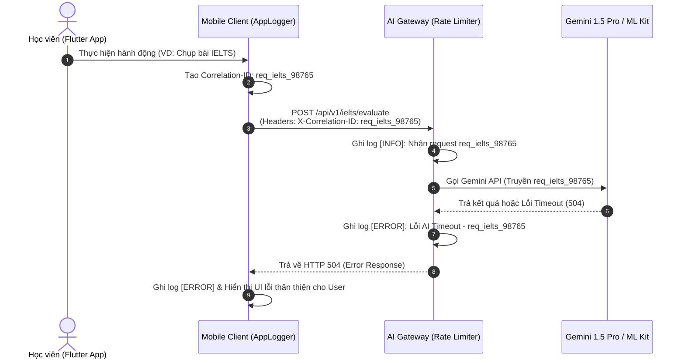

# 🚨 Quy chuẩn Xử lý Lỗi & Logging Hệ thống (Error Handling & Structured Logging)

Tài liệu này xác định các tiêu chuẩn bắt buộc cho việc xử lý ngoại lệ (exception handling), tạo nhật ký (logging) và truy vết lỗi (tracing/debugging) trên toàn bộ hệ thống **Language Learning & IELTS AI Assistant** (bao gồm Flutter Mobile Client và Node.js/FastAPI Backend).

> [!IMPORTANT]
> **Mục tiêu cốt lõi:** Đảm bảo mọi lỗi phát sinh trong hệ thống đều được ghi lại một cách có cấu trúc (Structured Logging), không rò rỉ thông tin nhạy cảm (PII/Tokens), và giúp các AI Agents (`OpenCode`, `Hermes`, `MiMo`, `Antigravity`) cũng như lập trình viên có thể truy vết chính xác nguyên nhân chỉ trong vài giây.

---

## 1. Kiến trúc Logging & Tracing (Logging Architecture)

Hệ thống sử dụng mô hình **Distributed Tracing** cơ bản thông qua `Correlation ID` (hoặc `Request ID`) để liên kết log từ ứng dụng di động (Client) đến AI Gateway và các dịch vụ AI phía sau (Gemini/TTS).



---

## 2. Chuẩn hóa Định dạng Log (Log Formatting Standards)

### 2.1. Yêu cầu bắt buộc về Trường dữ liệu (Mandatory Fields)
Mọi dòng log được xuất ra (tại Client Console hoặc Backend File/Log Aggregator) **BẮT BUỘC** phải tuân theo định dạng JSON có cấu trúc (hoặc format chuẩn hóa) với các trường sau:

| Trường (Field) | Kiểu dữ liệu | Mô tả chi tiết | Ví dụ |
| :--- | :--- | :--- | :--- |
| `timestamp` | ISO 8601 String | Thời gian chính xác xảy ra sự kiện (UTC hoặc Local kèm Timezone). | `"2026-07-04T14:15:00.123+07:00"` |
| `level` | String | Cấp độ log (`DEBUG`, `INFO`, `WARN`, `ERROR`, `FATAL`). | `"ERROR"` |
| `correlationId` | String | Mã định danh duy nhất của chuỗi thao tác/request (UUID v4 hoặc prefix). | `"req_ielts_8a1ea757"` |
| `tag` | String | Module hoặc tính năng phát sinh log. | `"[IELTS_OCR]"`, `"[N5_SRS]"`, `"[3D_TUTOR]"` |
| `message` | String | Mô tả ngắn gọn, rõ ràng bằng tiếng Anh/Việt về sự kiện hoặc lỗi. | `"Failed to parse OCR image from camera."` |
| `userId` | String | ID người dùng (Đã được ẩn danh hoá một phần hoặc Hash, KHÔNG ghi PII). | `"usr_9988_***"` |
| `metadata` | Object | Các thông số phụ trợ (độ trễ mạng, FPS, tên model 3D, mã lỗi HTTP). | `{"durationMs": 1250, "httpStatus": 500}` |
| `stackTrace` | String (Optional)| Stack trace chi tiết (Chỉ xuất hiện ở level `ERROR` hoặc `FATAL`). | `"Exception: DioException...\n at..."` |

### 2.2. Ví dụ Log JSON Chuẩn trên Backend (Node.js / FastAPI)
```json
{
  "timestamp": "2026-07-04T14:15:22.451Z",
  "level": "ERROR",
  "correlationId": "req_3d_chat_abc123",
  "tag": "[3D_TUTOR_CHAT]",
  "userId": "usr_7721_***",
  "message": "Gemini LLM API rate limit exceeded during real-time Q&A.",
  "metadata": {
    "model": "gemini-1.5-flash",
    "retryCount": 2,
    "httpStatus": 429
  },
  "stackTrace": "Error: 429 Too Many Requests\n    at GeminiClient.ask (/app/services/gemini.ts:45)\n    at ChatController.handle (/app/controllers/chat.ts:12)"
}
```

---

## 3. Phân cấp Log (Log Levels & When to Use)

| Cấp độ (Level) | Mục đích & Thời điểm sử dụng | Ai/Công cụ quan tâm? |
| :--- | :--- | :--- |
| `DEBUG` | Dùng trong quá trình phát triển (Dev/Test): kiểm tra FPS render mô hình 3D, tọa độ chạm trên Canvas vẽ chữ Kanji, payload chi tiết của API. **Tắt trên Môi trường Production**. | `OpenCode`, Lập trình viên |
| `INFO` | Ghi lại các mốc sự kiện quan trọng: Người dùng đăng nhập thành công, hoàn thành bài kiểm tra SRS N5, nộp bài thi IELTS Writing, kết nối WebSocket 3D Tutor thành công. | `MiMo` (QA), System Monitor |
| `WARN` | Cảnh báo tình trạng bất thường nhưng hệ thống vẫn tự phục hồi được: Token sắp hết hạn (đang chạy Refresh Token), tốc độ render 3D tụt xuống dưới 45 FPS, kết nối mạng chập chờn. | `Hermes`, Performance QA |
| `ERROR` | Lỗi chức năng ảnh hưởng đến thao tác của người dùng: Gọi API Gemini thất bại, lỗi phân tích OCR ML Kit, lỗi đọc/ghi DB cục bộ (`Hive`/`Isar`), mất kết nối WebSocket không phục hồi được. | **Toàn bộ AI Agents**, Support Team |
| `FATAL` | Lỗi nghiêm trọng làm sập ứng dụng (Crash / Unhandled Exception) hoặc sập toàn bộ Database/Gateway. | `Hermes`, System Admin |

---

## 4. Quy tắc Xử lý Lỗi trong Mã nguồn (Coding Error Handling Rules)

### 4.1. Tầng Flutter Client (Clean Architecture)
- **Tuyệt đối không dùng `try-catch` rỗng (Swallowing Exceptions):** Mọi exception bắt được trong Repository hoặc Data Source đều phải được log lại qua `AppLogger` và chuyển đổi thành `Failure` object trước khi trả về cho `BLoC/Cubit`.
- **Sử dụng `Either<Failure, Success>` (như gói `fpdart` hoặc `dartz`):**
  ```dart
  // Chuẩn mực trong Repository Layer
  Future<Either<Failure, EvaluationReport>> evaluateIeltsEssay(String essayText) async {
    final correlationId = IDGenerator.generate();
    AppLogger.info(tag: '[IELTS_EVAL]', msg: 'Starting evaluation', correlationId: correlationId);
    try {
      final result = await remoteDataSource.evaluate(essayText, correlationId);
      return Right(result);
    } on ServerException catch (e, stack) {
      AppLogger.error(
        tag: '[IELTS_EVAL]',
        msg: 'Server error during IELTS evaluation: ${e.message}',
        correlationId: correlationId,
        stackTrace: stack,
      );
      return Left(ServerFailure(e.message, correlationId: correlationId));
    } catch (e, stack) {
      AppLogger.error(tag: '[IELTS_EVAL]', msg: 'Unexpected error', stackTrace: stack);
      return Left(UnexpectedFailure('Đã xảy ra lỗi không mong muốn. Vui lòng thử lại sau.'));
    }
  }
  ```
- **Phản hồi UI thân thiện:** Không bao giờ hiển thị thông báo lỗi kỹ thuật thô (như `SocketException`, `NullPointerException`) trực tiếp lên màn hình người dùng. Hãy hiển thị thông báo dễ hiểu kèm mã `Correlation ID` để học viên báo cáo hỗ trợ khi cần.

### 4.2. Tầng Backend AI Gateway
- **Centralized Error Handling Middleware:** Tất cả các lỗi phát sinh trong controller hoặc service phải được bắt bởi một Middleware xử lý lỗi tập trung.
- **Mã lỗi HTTP chuẩn (HTTP Status Codes):**
  - `400 Bad Request`: Dữ liệu đầu vào sai (VD: ảnh bài thi quá mờ, văn bản IELTS rỗng).
  - `401 Unauthorized`: Token hết hạn hoặc không hợp lệ.
  - `429 Too Many Requests`: Người dùng spam gửi bài chấm điểm hoặc chat 3D vượt giới hạn Rate Limit.
  - `500 Internal Server Error` / `502 Bad Gateway`: Lỗi từ phía dịch vụ AI (Gemini / TTS).

---

## 5. Hướng dẫn AI Truy vết & Tìm lỗi (AI Troubleshooting Guide)

Khi một đại lý AI (như `OpenCode`, `MiMo`, hoặc `Antigravity`) được giao nhiệm vụ sửa lỗi từ log hoặc báo cáo lỗi, hãy thực hiện theo quy trình 4 bước chuẩn sau:

1. **Tìm kiếm theo `Correlation ID`:**
   - Dùng công cụ `grep_search` hoặc tìm trong log file với từ khóa `correlationId` của chuỗi bị lỗi.
   - Trích xuất toàn bộ vòng đời (lifecycle) của request từ Client -> Gateway -> LLM Service.
2. **Xác định Vùng Lỗi (Fault Isolation):**
   - Kiểm tra `tag` (VD: `[IELTS_OCR]`, `[N5_SRS]`, `[3D_TUTOR]`).
   - Kiểm tra xem lỗi xảy ra ở tầng nào:
     - *Lỗi mạng/Auth:* Kiểm tra log tại `AUTH_SVC` và HTTP status `401`/`403`.
     - *Lỗi render 3D/Canvas:* Kiểm tra log Flutter Client xem có bị lỗi bộ nhớ (Out of Memory / FPS drop) hay không.
     - *Lỗi AI chấm điểm:* Kiểm tra log `EVAL_SVC` xem Gemini API trả về cấu trúc JSON sai hay bị Timeout.
3. **Phân tích Stack Trace & Kiểm tra GitNexus:**
   - Đọc kỹ `stackTrace` trong log `ERROR`/`FATAL`.
   - Chạy lệnh `gitnexus_context` hoặc `gitnexus_impact` trên symbol/hàm phát sinh exception trong stack trace để hiểu rõ ảnh hưởng trước khi tiến hành sửa mã nguồn.
4. **Viết Test Case Tái hiện Lỗi (Regression Test):**
   - Trước khi sửa code, viết một bài Unit Test hoặc Integration Test mô phỏng lại đúng dữ liệu đầu vào đã gây ra lỗi trong log.
