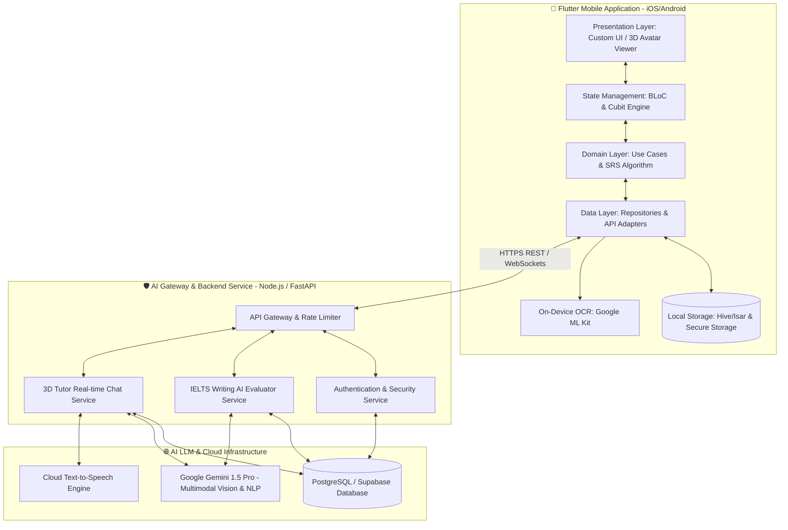

# 🚀 Kế hoạch Tổng thể & Đặc tả Hệ thống: Language Learning & IELTS AI Assistant (3D Avatar)

Dự án được xây dựng theo tiêu chuẩn **Portfolio-Grade Application** kết hợp công nghệ di động cao cấp (**Flutter 3.x**), quản lý state phức tạp (**BLoC/Clean Architecture**), xử lý Ngôn ngữ tự nhiên (**NLP & Multimodal AI Gemini 1.5 Pro/Flash**), và mô hình **3D Avatar tương tác trực tiếp**.

Dưới sự điều phối của **Antigravity**, quy trình **Spec-Driven Development (SDD)** được áp dụng chặt chẽ, phân vùng rõ ràng cho các chuyên gia AI trong đội ngũ: **OpenCode**, **Hermes**, và **MiMo**.

---

## 👥 1. Ma trận Phân quyền & Điều phối Đa Đại lý (Multi-Agent Team Matrix)

| Đại lý (Agent Role) | Vai trò trong SDD Workflow | Trách nhiệm Kỹ thuật Cốt lõi |
| :--- | :--- | :--- |
| 🪐 **Antigravity** *(Điều phối viên / Thợ code phụ)* | SDD Orchestrator & UI Assistant | Điều phối tiến độ SDD (`constitution`, `specify`, `plan`, `tasks`); viết trợ giúp mã nguồn UI, Design System, micro-animations và liên kết 3D Avatar. |
| 💻 **OpenCode** *(Thợ code chính / Lead Dev)* | Core Implementation & Architecture | Thiết kế kiến trúc Clean Architecture, triển khai BLoC/Cubit, xây dựng thuật toán Spaced Repetition (SRS), tích hợp OCR ML Kit, WebSockets và AI Backend Gateway. |
| ⚡ **Hermes** *(DevOps / Hạ tầng)* | Infrastructure & Automation | Thiết lập môi trường NestJS/FastAPI Backend, PostgreSQL/Prisma, cấu hình Docker containerization, quản lý CI/CD pipelines và bảo mật môi trường. |
| 🔍 **MiMo** *(Phân tích / QA Reviewer)* | Convergence & Quality Control | Phân tích yêu cầu bài toán, review mã nguồn, kiểm thử hiệu năng (FPS khi render 3D, tốc độ xử lý OCR), kiểm định bảo mật dữ liệu (`flutter_secure_storage`). |

---

## 🏛️ 2. Kiến trúc Hệ thống & Quản lý State Phức tạp

### 2.1. Sơ đồ Kiến trúc & Luồng Dữ liệu (System Architecture)



### 2.2. Quản lý State với BLoC & Clean Architecture
Để giải quyết bài toán phức tạp về state (đồng bộ offline/online, streaming câu trả lời chat, tải mô hình 3D, xử lý OCR ảnh chụp), ứng dụng chia làm 3 tầng độc lập:
- **`Domain Layer`**: Chứa Business Logic nguyên thủy không phụ thuộc vào UI hay Framework (Entities, SRS SuperMemo-2 calculation, Use Cases).
- **`Data Layer`**: Quản lý việc fetch dữ liệu từ Local DB (Hive/Isar) hoặc Remote API (AI Gateway), xử lý caching và Token Refresh tự động.
- **`Presentation Layer`**: Sử dụng `BlocBuilder` và `BlocListener` để phản hồi tức thì với các State thay đổi (ví dụ: chuyển trạng thái 3D Avatar từ `idle` sang `thinking` khi AI đang chấm bài).

---

## 🎨 3. Đặc tả Giao diện & Trải nghiệm Người dùng (UI/UX Specifications)

Thiết kế theo triết lý **Premium Portfolio Design**, mang lại ấn tượng thị giác mạnh mẽ và trải nghiệm tương tác sinh động:

```carousel
### 🎌 Giao diện Luyện từ vựng Tiếng Nhật N5
- **Màu sắc chủ đạo:** Vibrant Sakura Pink (`#FF85A2`) kết hợp Deep Indigo (`#1A1E36`).
- **Thẻ Flashcard 3D:** Hiệu ứng lật thẻ (3D Flip Animation) hiển thị Kanji/Kana mặt trước và nghĩa, ví dụ mặt sau.
- **Bảng vẽ cảm ứng (Handwriting Canvas):** Luyện viết chữ Kana/Kanji trực tiếp trên màn hình với hướng dẫn từng nét vẽ (Stroke Order verification) và phản hồi xúc giác (Haptic Feedback) khi viết đúng/sai.
<!-- slide -->
### 📝 Giao diện Luyện thi IELTS Writing Task 1 & OCR
- **Màu sắc chủ đạo:** Sleek Academic Navy (`#0F172A`) kết hợp Gold Accent (`#F59E0B`).
- **Trình soạn thảo đôi (Dual Mode Input):**
  - Gõ văn bản trực tiếp với bộ đếm từ và đồng hồ đếm ngược 20 phút.
  - Chụp ảnh bài viết tay: Tự động crop ảnh, canh sáng và nhận dạng chữ viết tay (OCR), hiển thị màn hình đối chiếu ảnh và văn bản số hóa.
- **Báo cáo Chấm điểm AI (AI Grading Dashboard):** Biểu đồ Radar 4 tiêu chí IELTS, hệ thống highlight lỗi ngữ pháp kèm câu sửa và thẻ đề xuất từ vựng học thuật nâng cao.
<!-- slide -->
### 🤖 Giao diện Trợ lý 3D AI Tutor & Hỏi đáp (Q&A)
- **3D Avatar Integration:** Mô hình 3D (Sensei / IELTS Examiner) hiển thị sắc nét ở nửa trên màn hình Chat.
- **Đồng bộ Hoạt ảnh (Dynamic Animations):**
  - `Greeting`: Gật đầu chào khi mở app.
  - `Thinking`: Gõ nhịp tay/suy nghĩ khi đang phân tích bài IELTS.
  - `Talking`: Cử động miệng (Lip-syncing) đồng bộ với âm thanh trả lời TTS.
  - `Cheering`: Vỗ tay chúc mừng khi học viên đạt điểm cao hoặc hoàn thành bài ôn tập SRS.
```

---

## 📋 4. Lộ trình Triển khai & Phân định Nhiệm vụ (SDLC Roadmap)

Dưới đây là chi tiết lộ trình phát triển được rà soát bởi **Antigravity** và giao việc cho từng đại lý theo chuẩn `/speckit.tasks`:

| Giai đoạn | Tên Giai đoạn / Mục tiêu | Đại lý Chủ trì | Các Nhiệm vụ Trọng tâm |
| :---: | :--- | :---: | :--- |
| **Giai đoạn 1** | **Khởi tạo & Cấu hình Hạ tầng** *(Infrastructure & Project Setup)* | `[Hermes]` & `[MiMo]` | - Khởi tạo project Flutter Clean Architecture & backend NestJS/FastAPI.<br>- Thiết lập Docker, PostgreSQL/Prisma và GitHub Actions CI/CD pipeline.<br>- Kiểm duyệt quy chuẩn bảo mật API Key và biến môi trường. |
| **Giai đoạn 2** | **Core Framework & State Management** | `[OpenCode]` & `[Antigravity]` | - Xây dựng tầng Network Client (Dio HTTP) với cơ chế tự động làm mới Token.<br>- Cấu hình Local DB (Hive/Isar) cho học Offline.<br>- Xây dựng Design System (Colors, Typography, Helper utilities). |
| **Giai đoạn 3** | **Module Tiếng Nhật N5 & Handwriting** | `[OpenCode]` & `[Antigravity]` | - Triển khai thuật toán Spaced Repetition (SRS SuperMemo-2) trong tầng Domain.<br>- Xây dựng tính năng vẽ chữ Kana và kiểm tra nét vẽ trên Canvas CustomPainter.<br>- Viết giao diện thẻ Flashcard xoay 3D và hệ thống Quiz trắc nghiệm. |
| **Giai đoạn 4** | **Module IELTS Writing Task 1 & OCR AI** | `[OpenCode]` & `[MiMo]` | - Tích hợp Google ML Kit OCR nhận diện chữ viết tay từ camera chụp bài thi.<br>- Kết nối Gemini 1.5 Pro Multimodal Backend để chấm điểm 4 tiêu chí IELTS.<br>- Viết giao diện báo cáo chấm điểm chi tiết kèm highlight lỗi ngữ pháp. |
| **Giai đoạn 5** | **Trợ lý 3D AI Tutor & Hỏi đáp Trực tuyến** | `[OpenCode]` & `[Antigravity]` | - Tích hợp `model_viewer_plus`/`flutter_3d_controller` render mô hình 3D `.glb` nhẹ.<br>- Xây dựng dịch vụ Real-time Chat WebSockets/SSE kết nối Text-to-Speech (TTS).<br>- Đồng bộ hoạt ảnh 3D Avatar (`idle`, `talking`, `happy`, `thinking`) với API trả về. |
| **Giai đoạn 6** | **Tối ưu hóa UI/UX & Đóng gói Portfolio** | `[Toàn bộ Đội ngũ]` | - Bổ sung micro-animations (Lottie, Shimmer loading), kiểm tra 60 FPS trên thiết bị.<br>- Tạo dữ liệu giả lập (Demo Seed Data) và đóng gói bản build APK/iOS cho Portfolio.<br>- Review toàn diện theo `/speckit.converge` và hiến pháp `/speckit.constitution`. |

---

## 🔒 5. Bảo mật & Quản lý Dữ liệu Người dùng

1. **Bảo mật API Key & AI Gateway:** Tuyệt đối không nhúng API Key của LLM (Gemini/OpenAI) trong mã nguồn Flutter Client. Mọi yêu cầu được proxy qua Backend AI Gateway để kiểm soát Rate Limit và xác thực quyền.
2. **Lưu trữ cục bộ An toàn (`flutter_secure_storage`):** Token đăng nhập (JWT/OAuth2), Refresh Token và thông tin cá nhân định danh (PII) được mã hóa bằng chuẩn AES-GCM trên thiết bị.
3. **Tuân thủ Quyền riêng tư (Privacy-First):** Ảnh chụp bài thi IELTS viết tay và dữ liệu trò chuyện với AI Tutor chỉ được phục vụ cho phân tích NLP; người dùng có toàn quyền xóa dữ liệu hoặc xuất toàn bộ lịch sử học tập.
