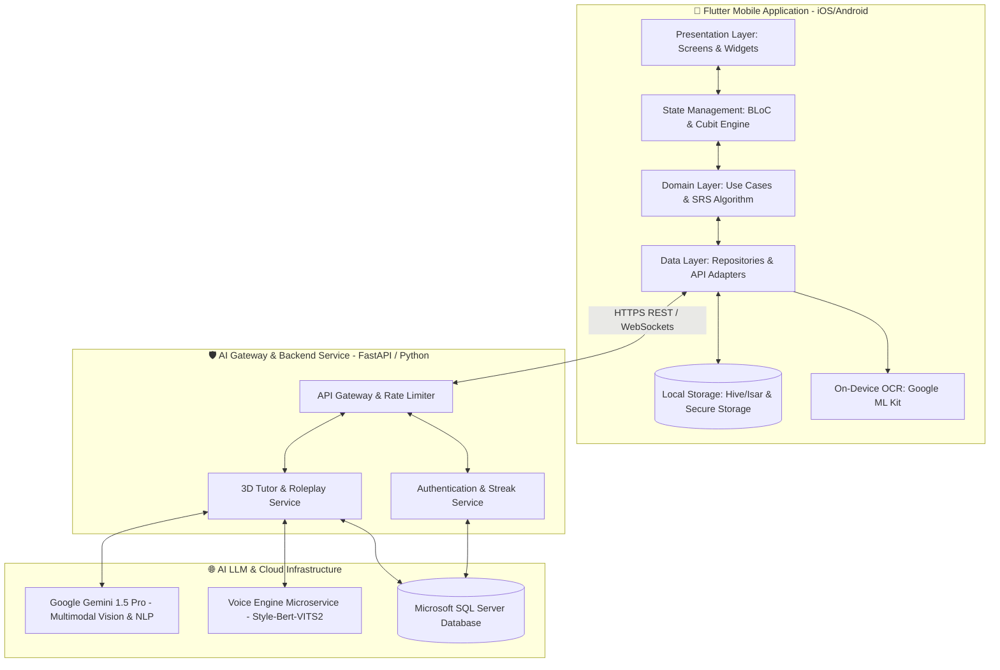

# 🚀 Kế hoạch Tổng thể & Đặc tả Hệ thống: Japanese N5/N4 & 3D AI Tutor Assistant (VTuber Avatar)

Dự án được xây dựng theo tiêu chuẩn **Portfolio-Grade Application** kết hợp công nghệ di động cao cấp (**Flutter 3.x**), quản lý state **Clean Architecture / BLoC**, xử lý Ngôn ngữ tự nhiên (**Multimodal AI Gemini 1.5 Pro/Flash**), và mô hình **3D Avatar tương tác trực tiếp**.

Dưới sự điều phối của **Antigravity**, quy trình **Spec-Driven Development (SDD)** được áp dụng chặt chẽ, phân cấp trách nhiệm rõ ràng cho các chuyên gia AI trong đội ngũ: **OpenCode**, **Hermes**, và **MiMo**.

> [!TIP]
> **Điều hướng Cây Tài liệu (`docs/` Tree):**
> Tài liệu này là tổng quan cao nhất về tiến trình SDD. Chi tiết kỹ thuật chuyên sâu được phân quyền xuống các tài liệu con theo nguyên tắc `write-docs`:
> - **Kiến trúc & Lập trình:** Xem [ai_coding_standards.md](file:///e:/GitHub/LanguageLearningApp/docs/architecture/ai_coding_standards.md)
> - **Quy chuẩn UI/UX & 3D Avatar:** Xem [ui_ux_and_3d_avatar_guidelines.md](file:///e:/GitHub/LanguageLearningApp/docs/ui/ui_ux_and_3d_avatar_guidelines.md)
> - **Bảo mật & Zero-Trust:** Xem [data_privacy_and_security.md](file:///e:/GitHub/LanguageLearningApp/docs/security/data_privacy_and_security.md)
> - **Kiểm thử 60 FPS & Latency:** Xem [ai_verification_and_testing.md](file:///e:/GitHub/LanguageLearningApp/docs/testing/ai_verification_and_testing.md)

---

## 👥 1. Ma trận Phân quyền & Điều phối Đa Đại lý (Multi-Agent Team Matrix)

| Đại lý (Agent Role) | Vai trò trong SDD Workflow | Trách nhiệm Kỹ thuật Cốt lõi |
| :--- | :--- | :--- |
| 🪐 **Antigravity** *(Điều phối viên / UI Assistant)* | SDD Orchestrator & Design Lead | Điều phối tiến độ SDD; xây dựng giao diện Flutter, Design System, micro-animations và liên kết 3D Avatar. |
| 💻 **OpenCode** *(Thợ code chính / Lead Dev)* | Core Implementation & Architecture | Thiết kế Clean Architecture, triển khai BLoC/Cubit, thuật toán Spaced Repetition (SRS SuperMemo-2), tích hợp OCR ML Kit & AI Gateway. |
| ⚡ **Hermes** *(DevOps / Hạ tầng)* | Infrastructure & Automation | Thiết lập FastAPI/Python Backend, SQL Server, Docker containerization, Voice Engine VITS microservice và bảo mật môi trường. |
| 🔍 **MiMo** *(QA Reviewer / Auditor)* | Quality Control & GitNexus Audit | Phân tích tác động GitNexus, review mã nguồn, kiểm thử hiệu năng (60 FPS, độ trễ OCR/AI), kiểm định bảo mật (`secure_storage`). |

---

## 🏛️ 2. Kiến trúc Hệ thống & Luồng Dữ liệu (System Architecture)



Kiến trúc chi tiết của từng tầng và các quy chuẩn phân định ranh giới được quy định tại [ai_coding_standards.md](file:///e:/GitHub/LanguageLearningApp/docs/architecture/ai_coding_standards.md).

---

## 🎨 3. Đặc tả Giao diện & Trải nghiệm Người dùng (UI/UX Specifications)

Thiết kế theo triết lý **Premium Portfolio Design** mang cảm hứng Duolingo (Vibrant Colors, Tactile 3D Buttons, Clean Workspace):

```carousel
### 🎌 Giao diện Luyện từ vựng Tiếng Nhật N5
- **Màu sắc:** Sakura Pink (`#FF85A2`) & Deep Indigo (`#1A1E36`).
- **Thẻ Flashcard 3D:** Lật thẻ mượt mà hiển thị Kanji/Romaji và ví dụ.
- **Bảng vẽ cảm ứng:** Luyện viết chữ Kana/Kanji trực tiếp với hướng dẫn thứ tự nét và phản hồi xúc giác.
<!-- slide -->
### ⛩️ Giao diện 3 Chuyên đề Luyện Ngữ pháp & Đề thi thử JLPT N5
- **Màu sắc:** Academic Navy (`#0F172A`) & Gold Accent (`#F59E0B`).
- **Luyện Ngữ pháp Kéo-Thả:** Sắp xếp khối từ (Pills) theo đúng trật tự câu tiếng Nhật SOV.
- **Đề thi thử JLPT Real-time Timer:** Kiểm tra trọn bộ Moji-Goi, Bunpou, Dokkai với đồng hồ đếm ngược và báo cáo AI.
<!-- slide -->
### 🤖 Giao diện Trợ lý 3D AI Tutor & Studio Cá nhân hóa (`Slide 3`)
- **3D Avatar Studio & Workbench:** Thử nghiệm biểu cảm (`happy`, `thinking`, `cheering`) và kiểm tra khẩu hình lip-sync âm vị tiếng Nhật (`あ`, `い`, `う`).
- **Đàm thoại Ngữ cảnh N5:** Luyện nghe và phát âm thực tế tại Konbini, Nhà ga, Nhà hàng qua tính năng Speech-to-Text & TTS VITS.
```

Chi tiết Design Tokens và quy tắc bố trí 3D Avatar xem tại [ui_ux_and_3d_avatar_guidelines.md](file:///e:/GitHub/LanguageLearningApp/docs/ui/ui_ux_and_3d_avatar_guidelines.md).

---

## 📋 4. Bản Đồ Hiện Trạng & Lộ Trình Triển Khai (SDLC Roadmap)

| Giai đoạn | Mục Tiêu & Chuyên Đề | Đại Lý Chủ Trì | Vị Trí Mã Nguồ / Trạng Thái Hiện Tại |
| :---: | :--- | :---: | :--- |
| **Giai đoạn 1** | **Khởi tạo & Hạ tầng Docker/Backend** | `[Hermes]` | [backend/](file:///e:/GitHub/LanguageLearningApp/backend) – Hoàn tất container FastAPI, MS SQL Server, `.env`. |
| **Giai đoạn 2** | **Core Framework & State Management** | `[OpenCode]` | [mobile/lib/core](file:///e:/GitHub/LanguageLearningApp/mobile/lib/core) – Hoàn tất Dio Network Client, Hive/Isar, Theme. |
| **Giai đoạn 3** | **Module Tiếng Nhật N5 & Handwriting** | `[OpenCode]` & `[Antigravity]` | [japanese_screen.dart](file:///e:/GitHub/LanguageLearningApp/mobile/lib/presentation/screens/japanese_screen.dart) – Hoàn tất SRS SuperMemo-2, 3D Flip Card, Canvas. |
| **Giai đoạn 4** | **Module IELTS Writing Task 1 & OCR AI** | `[OpenCode]` & `[MiMo]` | [ielts_screen.dart](file:///e:/GitHub/LanguageLearningApp/mobile/lib/presentation/screens/ielts_screen.dart) – Hoàn tất OCR ML Kit, Gemini Grading Report, Shimmer. |
| **Giai đoạn 5** | **Trợ lý 3D AI Tutor & Hỏi đáp Trực tuyến** | `[OpenCode]` & `[Antigravity]` | [chat_tutor_screen.dart](file:///e:/GitHub/LanguageLearningApp/mobile/lib/presentation/screens/chat_tutor_screen.dart) – Hoàn tất 3D Avatar Viewer, STT/TTS Chat. |
| **Giai đoạn 6** | **3 Chuyên Đề Nâng Cao N5 & Streak UI** | `[Toàn bộ Đội ngũ]` | Hoàn tất Đàm thoại ([n5_dialogue_roleplay_screen.dart](file:///e:/GitHub/LanguageLearningApp/mobile/lib/presentation/screens/n5_dialogue_roleplay_screen.dart)), Luyện Ngữ pháp ([n5_grammar_builder_screen.dart](file:///e:/GitHub/LanguageLearningApp/mobile/lib/presentation/screens/n5_grammar_builder_screen.dart)), Thi thử ([n5_jlpt_mock_exam_screen.dart](file:///e:/GitHub/LanguageLearningApp/mobile/lib/presentation/screens/n5_jlpt_mock_exam_screen.dart)), và Streak Card ([dashboard_screen.dart](file:///e:/GitHub/LanguageLearningApp/mobile/lib/presentation/screens/dashboard_screen.dart)). |

---

## 🔒 5. Bảo mật & Kiểm định Chất lượng
- **Bảo mật API & Token:** Tuân thủ chuẩn Zero-Trust trong [data_privacy_and_security.md](file:///e:/GitHub/LanguageLearningApp/docs/security/data_privacy_and_security.md).
- **Kiểm thử 3 Lớp & DevTools 60 FPS:** Tuân thủ quy trình kiểm định trong [ai_verification_and_testing.md](file:///e:/GitHub/LanguageLearningApp/docs/testing/ai_verification_and_testing.md).
