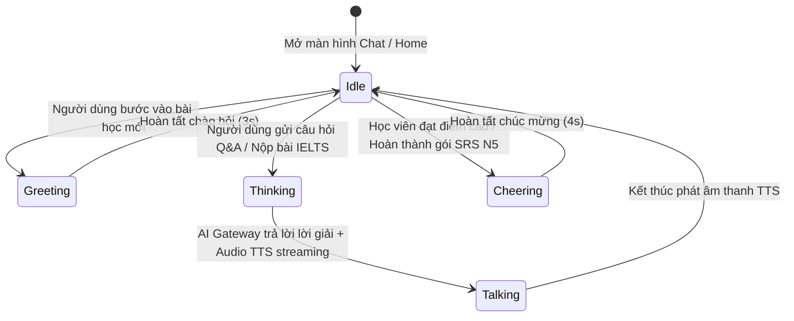
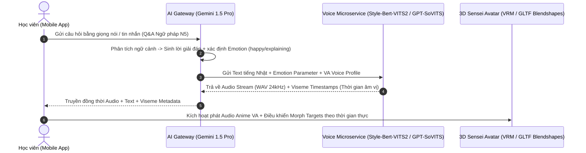

# 🎨 Quy chuẩn Giao diện UI/UX & Trợ lý 3D Avatar (UI/UX & 3D Avatar Design System)

Tài liệu này là hướng dẫn chuẩn mực cho việc thiết kế, xây dựng các thành phần giao diện (UI components), tối ưu trải nghiệm người dùng (UX) và tích hợp mô hình **3D Avatar tương tác trực tiếp** trong ứng dụng **Language Learning & IELTS AI Assistant**.

> [!TIP]
> **Triết lý Thiết kế: Premium Portfolio Design**
> Ứng dụng phải tạo được ấn tượng thị giác mạnh mẽ ngay từ cái nhìn đầu tiên (WOW factor). Sử dụng bảng màu hiện đại, typography sắc nét từ Google Fonts, kính mờ (Glassmorphism), gradient mượt mà và các hiệu ứng chuyển động nhỏ (Micro-animations) để thổi hồn vào trải nghiệm học tập.

---

## 1. Hệ thống Ngôn ngữ Thiết kế (Design System Tokens)

### 1.1. Bảng màu Chủ đạo (Curated Color Palettes)
Hệ thống sử dụng hai bảng màu riêng biệt được tinh chỉnh cho từng ngữ cảnh học tập, kết hợp với chế độ Tối/Sáng (Dark/Light Mode) liền mạch:

| Module / Ngữ cảnh | Tên màu (Color Token) | Mã HEX | Mục đích & Vị trí áp dụng |
| :--- | :--- | :--- | :--- |
| **Tiếng Nhật N5** | `Sakura Pink` (Primary) | `#FF85A2` | Nút bấm chính, viền thẻ Flashcard, thanh tiến độ học Kana. |
| *(Japanese Module)*| `Deep Indigo` (Background)| `#1A1E36` | Màu nền chủ đạo trong chế độ Dark Mode, mang lại cảm giác sâu thẳm, tập trung. |
| | `Zen Bamboo Green` (Success)| `#10B981` | Đánh dấu nét vẽ Kanji đúng, câu trả lời Quiz chính xác, điểm SRS Easy. |
| **IELTS Writing** | `Academic Navy` (Primary) | `#0F172A` | Màu nền trang trọng, chuẩn mực học thuật cho phòng thi IELTS Writing. |
| *(IELTS Module)* | `Gold Accent` (Highlight) | `#F59E0B` | Đánh dấu các từ vựng học thuật cao cấp (Lexical Upgrade), điểm Band 8.0+. |
| | `Coral Red` (Error/Alert) | `#EF4444` | Highlight các lỗi sai ngữ pháp, dấu câu trong bài viết IELTS OCR. |
| **Chung (Universal)**| `Glass White` (Surface) | `rgba(255,255,255,0.08)`| Thẻ nền Glassmorphism với độ mờ backdrop-blur 12px. |

### 1.2. Nghệ thuật Chữ (Typography - Google Fonts)
- **Font chính (UI & English/IELTS):** `Inter` hoặc `Outfit` – hiện đại, dễ đọc trên màn hình di động ở mọi kích thước.
- **Font tiếng Nhật (Kana & Kanji):** `Noto Sans JP` hoặc `Kosugi Maru` – đảm bảo hiển thị rõ ràng từng nét khắc của chữ Hán và Kana, hỗ trợ tốt cho việc hướng dẫn thứ tự nét vẽ (Stroke Order).

### 1.3. Tham chiếu Thiết kế từ Duolingo (Duolingo-Inspired Gamified & Clean UI System)
Để đạt tiêu chí **"Hiện đại & Gọn gàng" (Modern & Clean)** mang phong cách Duolingo, hệ thống giao diện cần áp dụng các nguyên tắc cốt lõi sau:

- **1. Triết lý "Gọn gàng & Rõ ràng" (Clean & Uncluttered Card Layouts):**
  - Thẻ bài (Cards) có độ bo tròn lớn (`BorderRadius.circular(16)` đến `20`), khoảng trắng thoáng đãng (Generous Whitespace).
  - Loại bỏ các đường viền mảnh rắc rối hoặc bóng đổ quá gắt; tập trung sự chú ý tuyệt đối vào nội dung câu hỏi và linh vật 3D Sensei.
- **2. Nút bấm 3D phản hồi cơ học (Chunky 3D Tactile Buttons):**
  - Nút bấm chính (Call-to-Action) luôn đi kèm viền bóng đổ dưới màu đậm hơn (Bottom Shadow Offset từ `4px` đến `6px`).
  - Khi chạm vào, nút bấm bị lún xuống nhẹ (tạo cảm giác nhấn vật lý sống động, giống hệt nút bấm trên máy chơi game Arcade hoặc app Duolingo).
- **3. Bảng màu năng lượng cao (Vibrant Gamified Tokens):**
  - `Duolingo Feather Green` (`#58CC02` | Shadow `#58A700`): Dành cho nút **Tiếp tục / Kiểm tra**, các đáp án đúng và thanh tiến độ bài học.
  - `Macaw Sky Blue` (`#1CB0F6` | Shadow `#1899D6`): Dành cho các thẻ gợi ý ngữ pháp, tip học tập nhanh từ Sensei.
  - `Bee Golden Yellow` (`#FFC800` | Shadow `#E5B400`): Dành cho biểu tượng chuỗi ngày học (Streak), huy chương, sao thưởng SRS.
  - `Cardinal Coral Red` (`#FF4B4B` | Shadow `#D03838`): Dành cho cảnh báo lỗi sai, điểm yếu ngữ pháp cần ôn tập lại.
- **4. Lộ trình học tập kiểu bản đồ (Step-by-Step Path / Node Map):**
  - Các bài học N5 được hiển thị theo chuỗi bước nối tiếp nhau theo trục dọc (Lesson Path), tạo cảm giác chinh phục từng chặng rõ ràng, hoàn thành bước trước mới mở khóa bước sau kèm hiệu ứng ăn mừng (Confetti).
- **5. Đồng hành cùng Linh vật AI 3D (3D Mascot Companion):**
  - Giống như cú Duo, nhân vật 3D Sensei xuất hiện bên cạnh các câu hỏi khó để làm mẫu giải thích (`explaining`), vỗ tay chúc mừng khi học viên chọn đúng (`cheering`), và chớp mắt/nghiêng đầu lắng nghe khi học viên đang tương tác (`idle`/`thinking`).

---

## 2. Chuẩn hóa Các Thành phần Giao diện Cốt lõi (Core Components)

### 2.1. Thẻ Flashcard Xoay 3D (3D Flip Flashcard - N5 Module)
- **Yêu cầu tương tác:** Chạm hoặc vuốt nhẹ để lật thẻ giữa mặt trước (Kanji/Kana + Audio Button) và mặt sau (Nghĩa tiếng Việt/Anh + Romaji + Câu ví dụ).
- **Hiệu ứng vật lý:** Sử dụng `Transform(transform: Matrix4.identity()..setEntry(3, 2, 0.001)..rotateY(angle))` với đường cong chuyển động `Curves.easeInOutCubic` (thời lượng 400ms).

### 2.2. Bảng vẽ Cảm ứng Luyện chữ (Handwriting Canvas)
- **CustomPainter & Touch Tracking:** Sử dụng `CustomPaint` để ghi nhận tọa độ ngón tay/bút vẽ với tốc độ lấy mẫu cao (mượt mà không bị đứt nét).
- **Phản hồi xúc giác (Haptic Feedback):**
  - Khi viết đúng thứ tự nét (Stroke Order matching): Phát rung nhẹ (`HapticFeedback.lightImpact()`).
  - Khi viết sai hoặc vẽ chệch hướng: Phát rung cảnh báo (`HapticFeedback.vibrate()`) kèm nháy viền màu đỏ nhạt.

### 2.3. Màn hình Đối chiếu & Chấm điểm IELTS (AI Grading Dashboard)
- **Biểu đồ Radar 4 Tiêu chí:** Sử dụng biểu đồ radar (như gói `fl_chart`) để hiển thị trực quan cân bằng điểm số giữa *Task Achievement*, *Coherence*, *Lexical*, và *Grammar*.
- **Smart Text Highlight:** Đoạn văn bản IELTS sau khi chấm sẽ có các từ/cụm từ được gạch chân màu sắc theo loại lỗi. Khi học viên chạm vào từ bị lỗi, một BottomSheet Glassmorphism sẽ trượt lên hiển thị nguyên nhân và câu sửa gợi ý từ AI.

---

## 3. Tích hợp Trợ lý 3D Avatar Tương tác (3D AI Tutor Integration)

### 3.1. Công nghệ Render & Quản lý Mô hình
- Sử dụng thư viện `model_viewer_plus` hoặc `flutter_3d_controller` để render mô hình định dạng `.glb` / `.gltf` nhẹ (dung lượng tối ưu dưới 3MB/mô hình để đảm bảo tải nhanh và không gây trễ FPS).
- Mô hình 3D (nhân vật **Sensei** cho Tiếng Nhật hoặc **IELTS Examiner** cho IELTS) được bố trí ở nửa trên hoặc góc màn hình hội thoại Q&A.

### 3.2. Đồng bộ Hoạt ảnh với Trạng thái AI (Animation State Sync)
Trạng thái của 3D Avatar phải được điều khiển trực tiếp bởi `BLoC/Cubit` dựa trên luồng phản hồi của AI Gateway và Text-to-Speech (TTS):

| Trạng thái Avatar (`State`) | Hoạt ảnh 3D (`Animation Name`) | Kích hoạt khi nào? |
| :--- | :--- | :--- |
| `idle` | `Idle_Breathing` / `Blink` | Trạng thái nghỉ mặc định, nhân vật thở nhẹ, thỉnh thoảng chớp mắt tự nhiên. |
| `greeting` | `Bow_Welcome` / `Wave_Hand` | Khi người dùng vừa mở app hoặc chọn vào module học tập. |
| `thinking` | `Hand_On_Chin` / `Pondering` | Trong khi chờ gọi API Gemini chấm bài IELTS hoặc phân tích câu hỏi khó (độ trễ 2-8s). |
| `talking` | `Talk_LipSync` / `Explain_Gesture`| Đồng bộ chính xác với thời điểm luồng âm thanh TTS đang phát ra loa/tai nghe. |
| `cheering` | `Clap_Hands` / `Happy_Jump` | Khi người dùng hoàn thành xuất sắc bài kiểm tra hoặc đạt Band IELTS từ 7.0 trở lên. |

### 3.3. Kiến trúc Clone Giọng nói Anime VA & Biểu cảm 3D Chuẩn VTuber (Open-Source Anime Voice Cloning & Real-Time Facial Expressions)
Để mang lại trải nghiệm tương tác giọng nói (Voice Chat) sống động như người thật – nơi Sensei đóng vai trò là một nhân vật Anime đồng hành với chất giọng của một diễn viên lồng tiếng (Voice Actor - VA) chuyên nghiệp, hệ thống áp dụng tiêu chuẩn kiến trúc kỹ thuật sau:

#### A. Các Repository Mã nguồn mở Hàng đầu trên GitHub (Top Open-Source Voice Cloning Engines)
Thay vì sử dụng System TTS cơ học, hệ thống tích hợp các bộ engine mã nguồn mở hàng đầu thế giới về clone giọng nhân vật Anime:
1. **Style-Bert-VITS2 (Đề xuất Số 1 cho Tiếng Nhật & Anime VA):**
   - *Repository:* `https://github.com/litagin02/Style-Bert-VITS2`
   - *Đặc điểm:* Tiêu chuẩn vàng trong cộng đồng VTuber Nhật Bản. Có khả năng kiểm soát xuất sắc ngữ điệu và cao độ tiếng Nhật (Pitch Accent), đảm bảo phát âm mẫu câu N5 chuẩn xác 100% không bị ngọng hay sai dấu. Hỗ trợ clone giọng VA chỉ với 5-10 phút audio mẫu sạch, kiểm soát cảm xúc đa dạng (`Happy`, `Sad`, `Angry`, `Explaining`).
2. **GPT-SoVITS (Top 1 Trending Zero-Shot Voice Cloning):**
   - *Repository:* `https://github.com/RVC-Boss/GPT-SoVITS`
   - *Đặc điểm:* Engine Zero-Shot Voice Cloning mạnh mẽ nhất thế giới hiện nay. Chỉ cần **5 giây đến 1 phút** audio tham chiếu của nhân vật Anime (ví dụ: chất giọng ấm áp của VA *Kana Hanazawa* hoặc sự năng động của *Rie Takahashi*) để tái tạo giọng đọc mới với độ tự nhiên lên tới 95%. Tích hợp sẵn REST API Server (FastAPI), dễ dàng triển khai thành microservice trong Docker.
3. **Fish-Speech / XTTS-v2:**
   - Các mô hình TTS mã nguồn mở xuất sắc hỗ trợ đa ngôn ngữ với chi phí tính toán tối ưu cho môi trường edge/cloud hybrid.

#### B. Luồng Kỹ thuật Tích hợp Giọng nói & Biểu cảm (End-to-End Voice & Expression Flow)

#### C. Tiêu chuẩn Mô hình 3D VRM & Cờ Blendshape (VTuber Blendshapes & Lip-Sync)
Để nhân vật Sensei có biểu cảm khuôn mặt và nhấp nháy môi khớp từng chữ với giọng đọc Anime VA, mô hình 3D tuân thủ tiêu chuẩn **VRM (VTuber Avatar Standard)** hoặc GLTF có tích hợp **Morph Targets (Blendshapes)**:
- **1. Khớp khẩu hình môi theo âm vị Tiếng Nhật (Lip-sync Visemes):**
  - Sử dụng 5 morph targets cơ bản tương ứng với 5 nguyên âm tiếng Nhật: `mouth_a` (あ), `mouth_i` (い), `mouth_u` (う), `mouth_e` (え), `mouth_o` (お).
  - Khi luồng âm thanh phát ra, Javascript Bridge trong `ModelViewer` / Flutter cập nhật độ mở môi (`morphTargetInfluences` từ `0.0` đến `1.0`) liên tục theo từng mili-giây của âm thanh.
- **2. Biểu cảm cảm xúc sống động (Micro-Facial Expressions):**
  - `Joy` / `Happy`: Đôi mắt cong lên thành hình trăng khuyết, nụ cười rạng rỡ khi khen ngợi học viên.
  - `Angry` / `Serious`: Hơi chau mày, ánh mắt tập trung khi sửa lỗi sai ngữ pháp cho học viên.
  - `Thinking` / `Pondering`: Nghiêng đầu, mắt nhìn lên trên hoặc chớp nhẹ khi xử lý câu hỏi phức tạp.
  - `Blink`: Chớp mắt tự nhiên 3-5 giây một lần ở chế độ nghỉ (`Idle`), tạo cảm giác nhân vật hoàn toàn có sự sống!

---

## 4. Tối ưu Hóa Hiệu năng & Micro-animations (Performance & Polish)

### 4.1. Tiêu chí 60 FPS (Silky Smooth Performance)
- **Cấm Block UI Thread:** Các tác vụ tính toán nặng như chuyển đổi ảnh chụp bài thi IELTS sang chuẩn Base64 cho OCR, hoặc tính toán lịch lặp lại ngắt quãng SRS phải được thực thi trong background isolate (`compute()` hoặc `Isolate`).
- **Tối ưu 3D Render:** Khi người dùng cuộn khỏi màn hình có 3D Avatar hoặc tạm ẩn ứng dụng xuống nền, tạm dừng vòng lặp render 3D (`pauseAnimation()`) để tiết kiệm pin và bộ nhớ GPU.

### 4.2. Shimmer Loading & Transitions
- **Shimmer Skeletons:** Khi đang fetch dữ liệu bài học từ AI Gateway hoặc tải danh sách từ vựng, bắt buộc hiển thị khung xương Shimmer (mờ nhấp nháy màu Sakura Pink nhạt hoặc Navy nhạt) thay vì vòng quay loading (`CircularProgressIndicator`) đơn điệu.
- **Page Transitions:** Chuyển màn hình sử dụng hiệu ứng vuốt mượt mà kiểu iOS (Cupertino Page Transition) hoặc Fade-through theo chuẩn Material Design 3.

---

## 5. Hướng dẫn Kiểm tra UI/UX cho AI Agents (UI QA Checklist)

Khi đại lý `MiMo` hoặc `Antigravity` kiểm tra giao diện, hãy xác nhận các tiêu chí sau:
- [ ] **No Overflow Errors:** Kiểm tra trên màn hình kích thước nhỏ (như iPhone SE hoặc Android màn hình nhỏ) không bị lỗi dải màu vàng đen `A RenderFlex overflowed by x pixels`.
- [ ] **Contrast Ratio:** Văn bản tiếng Nhật và tiếng Anh phải có độ tương phản đủ cao so với màu nền (đặc biệt trên nền Glassmorphism) theo chuẩn WCAG AA.
- [ ] **3D State Responsiveness:** Kiểm tra khi chuyển từ trạng thái `thinking` sang `talking`, mô hình 3D không bị khựng (freeze/glitch) hoặc mất mô hình.
