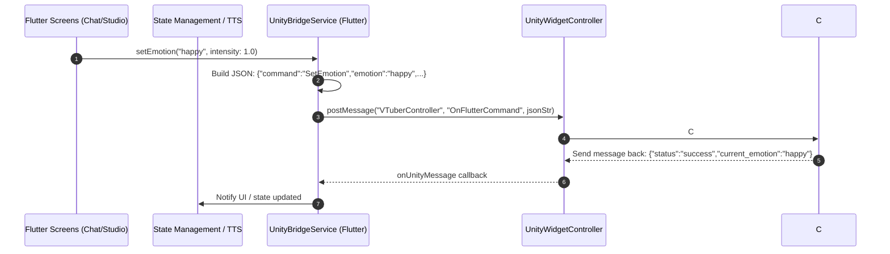

# 🏗️ Spec: Unity 3D VTuber Avatar Bridge Protocol & Dual-Engine Architecture

## 1. Tổng Quan & Mục Tiêu (Overview & Objectives)
Đặc tả này xác nghĩa kiến trúc nhúng **Unity 3D Engine** vào ứng dụng Flutter thông qua gói `flutter_unity_widget`, thay thế thế hệ `model_viewer_plus` (HTML `<model-viewer>`) để nâng cấp trải nghiệm VTuber lên tiêu chuẩn chuyên nghiệp:
- **Độ mượt:** Điều khiển xương bộ (Rigging Bones) & Blendshapes thời gian thực ở 60 FPS.
- **Tương tác Lip-sync Âm vị:** Pha trộn tự động các khẩu hình (`Visemes`: `mouth_a`, `mouth_i`, `mouth_u`, `mouth_e`, `mouth_o`) theo tín hiệu giọng nói AI.
- **Biểu cảm Cảm xúc:** Kết hợp mượt mà (Smooth transition/Lerp) các trọng số biểu cảm (`Emotions`: `happy`, `thinking`, `talking`, `idle`, `cheering`, `listening`).
- **Đa nền tảng liên tục (Dual-Engine Fallback):** Khi chạy trên Flutter Web (`kIsWeb`) hoặc trên máy chưa có bản build Unity C#, hệ thống tự động ngắt tải Unity và định tuyến về `ModelViewerEngine` (GLTF Web Viewer) mà không gây lỗi hoặc ngắt quãng luồng học tập của người dùng.

---

## 2. Kiến Trúc Cầu Nối Giao Tiếp (Bridge Communication Architecture)

### 2.1 Sơ Đồ Luồng Dữ Liệu (Data Flow)


### 2.2 Giao Thức Lệnh JSON (JSON Command Protocol)
Toàn bộ dữ liệu truyền từ Flutter sang Unity thông qua phương thức:
`UnityWidgetController.postMessage("VTuberController", "OnFlutterCommand", jsonString)`

#### A. Lệnh Cảm Xúc (`SetEmotion`)
```json
{
  "command": "SetEmotion",
  "emotion": "happy",
  "intensity": 1.0,
  "transitionDuration": 0.3
}
```

#### B. Lệnh Khẩu Hình (`SetViseme`)
```json
{
  "command": "SetViseme",
  "viseme": "mouth_a",
  "weight": 0.85,
  "decayDuration": 0.15
}
```

#### C. Lệnh Nạp Mô Hình (`LoadModel`)
```json
{
  "command": "LoadModel",
  "url": "data:application/octet-stream;base64,...",
  "format": "vrm",
  "workflow": "vrm_standard",
  "autoRetarget": true,
  "autoPlay": true
}
```
*Note: Tham số `format` hỗ trợ `vrm` hoặc `glb`. Tham số `workflow` hỗ trợ `vrm_standard` (UniVRM runtime) hoặc `auto_rigged_glb` (GLTFast runtime + Mecanim retargeting).*

#### D. Lệnh Chuyển Đổi Góc Máy (`SetCamera`)
```json
{
  "command": "SetCamera",
  "preset": "close_up",
  "smoothTime": 0.5
}
```

---

## 3. Ma Trận Trạng Thái Cảm Xúc & Khẩu Hình (Emotion & Viseme Matrix)

| Mã Trạng Thái (`ID`) | Nhóm (`Type`) | Blendshape C# Target | Mô Tả Trạng Thái & Kích Hoạt |
| :--- | :--- | :--- | :--- |
| `idle` | Emotion | `Blendshape_Neutral` | Trạng thái nghỉ ngơi, chớp mắt tự động mỗi 3-5 giây. |
| `talking` | Emotion | `Blendshape_Smile_Mild` | Trạng thái đang đàm thoại, mỉm cười nhẹ kết hợp nhịp đầu. |
| `thinking` | Emotion | `Blendshape_Ponder` | Trạng thái đang suy nghĩ câu trả lời AI, nghiêng đầu 15 độ. |
| `happy` | Emotion | `Blendshape_Joy_Full` | Trạng thái vui mừng khi người học phát âm đúng hoặc đạt chuỗi. |
| `listening` | Emotion | `Blendshape_Attentive`| Trạng thái lắng nghe người học thu âm qua micro. |
| `cheering` | Emotion | `Blendshape_Excited` | Vỗ tay và nhảy nhẹ chúc mừng hoàn thành bài học JLPT. |
| `mouth_a` | Viseme | `Viseme_A` (あ) | Mở rộng miệng phát âm các nguyên âm mở. |
| `mouth_i` | Viseme | `Viseme_I` (い) | Kéo hai mép sang ngang phát âm âm I/E. |
| `mouth_u` | Viseme | `Viseme_U` (う) | Tròn môi phát âm âm U/O. |
| `mouth_e` | Viseme | `Viseme_E` (え) | Mở miệng vừa phải phát âm E. |
| `mouth_o` | Viseme | `Viseme_O` (お) | Chu môi tròn lớn phát âm O. |

---

## 4. Tích Hợp Giao Diện Đa Năng (`Dual-Engine Interface`)
Lớp `Avatar3dViewer` sẽ kiểm tra môi trường lúc chạy:
- Nếu `!kIsWeb && _unityEnabled`: Khởi tạo `UnityAvatarEngine` chứa `UnityWidget`.
- Nếu `kIsWeb || !_unityEnabled`: Khởi tạo `ModelViewerEngine` (sử dụng `model_viewer_plus`).
- Khi người dùng tương tác (`onTap`, `onUploadTap`, thay đổi `emotion`), `Avatar3dViewer` tự động phân phối tín hiệu tới Engine đang hoạt động.

---

## 5. Kiến Trúc Dual-Workflow Cho Custom Avatar (VRM Standard vs AI Auto-Rigging)
Để giải quyết bài toán tải nhân vật cá nhân hóa (`Custom 3D Avatar`) và chạy hoạt ảnh nhép môi ngay lập tức mà không gây nghẽn hiệu năng trên thiết bị di động, hệ thống chuẩn hóa theo 2 luồng xử lý:

### 5.1 Luồng A: Tiêu Chuẩn Hóa VRM (`VRM Standard Workflow` - Khuyến nghị tối ưu)
- **Định nghĩa:** Người dùng tự thiết kế nhân vật từ phần mềm miễn phí **VRoid Studio** và xuất file theo chuẩn `.vrm`.
- **Thành phần chuẩn trong file `.vrm`:**
  1. Lưới hình học (`Mesh`) & vật liệu phong cách Anime (`MToon Shaders`).
  2. Bộ xương chuẩn Humanoid (`Humanoid Rig Bones`).
  3. **Biểu cảm khuôn mặt & Khẩu hình (`Blendshapes / Morph Targets`):** Các khẩu hình tiêu chuẩn `A, I, U, E, O` (`Visemes`) và cảm xúc `Joy`, `Sorrow`, `Angry`, `Fun`.
- **Cơ chế Runtime trong Unity (`UniVRM Loader`):**
  - Flutter gửi lệnh `LoadModelCommand` với `format = "vrm"`.
  - Script C# bên Unity gọi thư viện `UniVRM` để giải mã và dựng GameObject trực tiếp vào Runtime dưới 1 giây.
  - Ngay lập tức kết nối vào hệ thống Lip-sync và Animation mà **không cần qua máy chủ Auto-Rigging AI**.

### 5.2 Luồng B: Máy Chủ Auto-Rigging AI (`Backend ML Pipeline + GLTFast Retargeting`)
- **Định nghĩa:** Dành cho người dùng tải lên lưới đa giác 3D thô (`.glb` / `.obj`) chưa được gắn xương.
- **Quy trình Client - Server:**
  1. **Upload:** Flutter Client gửi file `.glb` thô lên Backend Server.
  2. **AI Auto-Rigging:** Máy chủ Python chạy mô hình Deep Learning (**RigNet** / **Mesh Skeleton Extraction API**) dự đoán khớp xương và tự động tính toán trọng số da (`Automatic Skin Weights`).
  3. **Xuất bản:** Server trả về file `.glb` đã gắn bộ xương chuẩn Humanoid.
  4. **Runtime Retargeting (`GLTFast` + `Mecanim`):** Unity C# sử dụng `GLTFast` tải model đã rig vào Scene. Sau đó, `Unity Mecanim Humanoid Avatar Builder` thực hiện tự động ánh xạ khớp xương (`Bone Mapping` / `Retargeting`) và `Inverse Kinematics (IK)` để áp dụng hoạt ảnh đàm thoại, suy nghĩ, vỗ tay sẵn có vào nhân vật mới.

